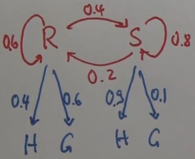
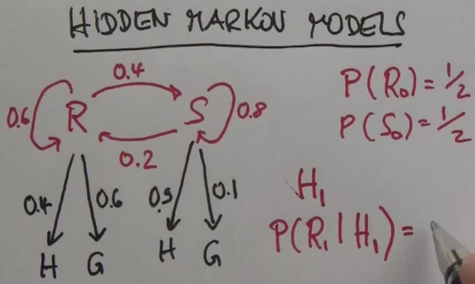
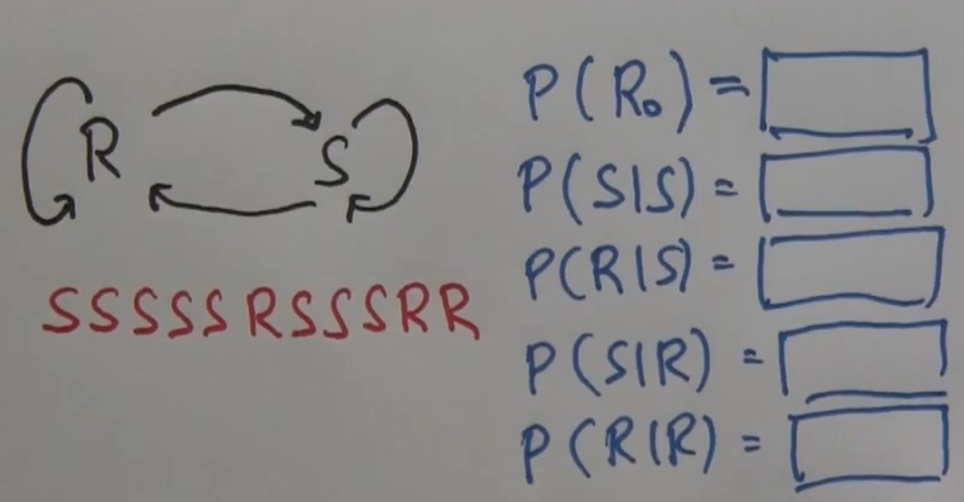
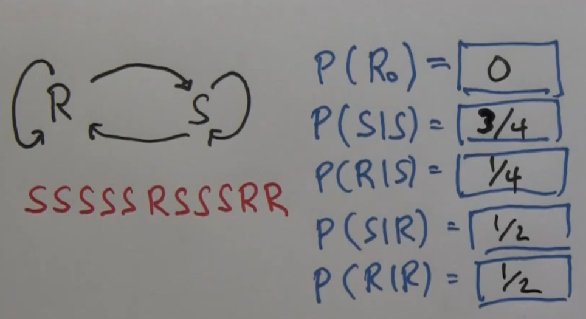

Markov Chains - Hidden Markov Models
====================================

Código del curso [CS50’s Introduction to Artificial Intelligence with Python](https://cs50.harvard.edu/ai/2024/), _lecture 2 "uncertainty"_, refactorizado a la nueva api de pomegranate v1.0.4 [jmschrei](https://pomegranate.readthedocs.io/en/latest/tutorials/B_Model_Tutorial_4_Hidden_Markov_Models.html)

## Instalación

Es necesario el uso del paquete [Pomegranate](https://pomegranate.readthedocs.io/en/stable/index.html):

> Pomegranate is a python package which implements fast, efficient, and extremely flexible probabilistic models ranging from probability distributions to Bayesian networks to mixtures of hidden Markov models.

`python -m venv venv`

`source venv/bin/activate`

Instalar la versión estricta de pomegranate `v1.0.4`:

`pip install -r requirements.txt`

o

`pip install pomegranate`

## Uso

### Markov Chain

Vamos a construir una cadena de Markov donde las variables aleatorias siguen la suposición de Markov: el estado actual depende sólo de un número finito de estados previos.

Supongamos que podemos definir la probabilidad de que mañana sea un dia soleado o llueva en función de cómo está el tiempo hoy. 

Definimos el modelo de transición de nuestro ejemplo de este modo:

Probabilidades iniciales de lluvia (R) y sol (S) en el primer día de la serie:

$$ P(R_0) = 0.5 $$
$$ P(S_0) = 0.5 $$

El modelo de transiciones es este:

|  Hoy  | Mañana|       |
| :---: | :---: | :---: |
|       |  sol  | lluvia|
| sol   |  0.8	|  0.2  |
| lluvia|  0.3  |   0.7 |

Calculamos un posible serie de predicciones sobre el estado del tiempo dadas la probabilidades iniciales y el modelo de transiciones:

```python
$ python markov_chain/model.py

Numero de muestras: 50
rain -> rain -> rain -> sun -> rain -> sun -> rain -> sun ->
rain ->rain -> rain -> rain -> rain -> sun -> sun -> sun ->
sun -> sun -> sun -> sun -> sun -> rain -> rain -> sun -> 
sun -> sun -> sun -> rain -> rain -> rain -> sun -> sun -> 
sun -> sun -> rain -> rain -> rain -> rain -> rain -> sun ->
sun -> rain -> sun -> sun -> sun -> rain -> rain -> rain -> sun -> sun
```

### Hidden Markov Model

En muchas ocasiones el estado del mundo es desconocido, pero de algún modo el agente inteligente es capaz de percibir información sobre el mundo mediante sus sensores. A partir de estas observaciones podemos inferir determinados aspectos del estado oculto, ya que dicho estado oculto influencia las observaciones.

Vamos a construir un modelo oculto de Markov en el que deduciremos el estado del tiempo en función de las observaciones que realiza nuestro agente inteligente sobre si las personas que entran en un edificio portan paragüas.


Las probabilidades de emisión son las siguientes:

| Estado| Observación|       |
| :---: | :---------:| :---: |
|       |  paraguas   | sin paraguas  |
| sol   |  0.2	     |  0.8  |
| lluvia|  0.9       |  0.1  |

Estas probabilidades de emisión dependen únicamente del estado del tiempo hoy. 

Proporcionamos al modelo una serie de observaciones y nos devuelve la secuencia de estados más probable (la explicación más probable).

```python
$ python hmm/model.py

Dimensiones del array de observaciones: (1, 9, 1)
umbrella -> rain
umbrella -> rain
no_umbrella -> sun
umbrella -> rain
umbrella -> rain
umbrella -> rain
umbrella -> rain
no_umbrella -> sun
no_umbrella -> sun
```

## Matemática de los Hidden Markov Models

Si $X_i$ son los estados ocultos y $Z_i$ son las emisiones, las expresiones de la teoría de probabilidad que conforman los parámetros de entrada de nuestro modelo son:

[1] **Regla de Bayes**:

$$ P(X_1 | Z_1) = \frac {P(Z_1 | X_1) P(X_1)} {P(Z_1)} = \alpha P(Z_1 | X_1) P(X_1) $$

[2] **Probabilidad total**:

$$ P(X_2) = \sum_{X_1} P(X_1)P(X_2|X_1) $$

donde $P(X_2|X_1)$ es la distribución de probabilidad del siguiente estado.

[3] La(s) distribuciones de **probabilidad**(es) del(os) estado(s) **inicial**(es):

$$ P(X_0) $$

### Ejercicio HMM

Aplicando las expresiones [1], [2] y [3] del epígrafe anterior, resuelve el siguiente problema.

Se trata de uno de los problemas propuestos en el MOCC sobre IA por Sebastian Thrun para explicar cómo se calculan las probabilidades de los estados ocultos dadas las observaciones.

Supongamos que queremos construir un modelo oculto de Markov para calcular el estado del tiempo en función del estado de humor de la población. En función de las observaciones sobre si la gente está feliz o gruñona deduciremos las probabilidades de que el día esté soleado o lluvioso.

En la figura se describen las probabilidades de transición entre los estados _Rainy_ $R$ y _Sunny_ $S$. Se proporcionan también las probabilidades de las emisiones _Happy_ $H$ y _Grumpy_ $G$. 



Se pide calcular la probabilidad de que el día 1 sea lluvioso $R_1$ en función de que la observación arroje que la gente está contenta ese día $H_1$:

$$ P(R_1|H_1)  $$

dadas las probabilidades iniciales de los estados:

$$ P(R_0) = 1/2 $$
$$ P(S_0) = 1/2 $$

Dispones de este ejercicio resuelto en este vídeo, 
como se indica en la figura:

[](https://drive.google.com/file/d/1b_URIpShIw3ta1TGi5a6VJa2A9dZXeTn/view?usp=drive_link)

#### Solución

En la regla de Bayes [1] sustituímos el estado oculto $X_i$ por el estado $R_1$ y la emisión u observación $Z_i$ por $H_1$:

$$ P(X_1 | Z_1) = \frac {P(Z_1 | X_1) P(X_1)} {P(Z_1)} $$


$$ P(R_1|H_1) = \frac {P(H_1 | R_1) P(R_1)} {P(H_1)} $$

Debemos calcular, por tanto, las probalidades:

* $P(H_1 | R_1)$
* $P(R_1)$
* $P(H_1)$

##### $P(H_1 | R_1)$

La probabilidad de que la gente sea feliz si el día es lluvioso, o $P(H_1 | R_1)$, se lee directamente en la figura: $0.4$

##### $P(R_1)$

Para el cálculo de la probabilidad de que el día 1 sea lluvioso $P(R_1)$ usamos el teorema de la probilidad total [2]:

$$ P(X_2) = \sum_{X_1} P(X_1) P(X_2|X_1) $$

$$ P(R_1) = P(R_1|R_0) P(R_0) + P(R_1|S_0) P(S_0) = 0.6 \times 0.5 + 0.2 \times 0.5 = 0.4 $$

extrayendo las probabilidades de transición entre los estados $R$ y $S$ directamente de la figura, y sustituyendo las probabilidades iniciales por los valores proporcionados $P(R_0) = 1$, 
$P(S_0) = 0$, que corresponden al parámetro de entrada [3] de nuestro modelo.

##### $P(H_1)$

La probablidad de que en el día 1 la gente esté feliz $H_1$ se calcula a través de la probabilidad total [2]:

$$ P(H_1) = P(H_1|R_1) P(R_1) + P(H_1|S_1) P(S_1) = 0.4 \times P(R_1) + 0.9 \times P(S_1) $$

La probabilidad $P(R_1)$ la hemos calculado anteriormente: $P(R_1)=0.4$

Necesitamos calcular la probabilidad total de que el día 1 sea soleado $P(S_1)$:

$$ P(S_1) = P(S_1|S_0) P(S_0) + P(S_1|R_0) P(R_0) = 0.8 \times 0.5 + 0.4 \times 0.5 = 0.6 $$

que introducida en la expresión $P(H_1)$ ofrece:

$$ P(H_1) = 0.4 \times 0.4 + 0.9 \times 0.6 = 0.7 $$

Disponemos ya de todos las probabilidades para sustituir en la expresión:

$$ P(R_1|H_1) = \frac {P(H_1 | R_1) P(R_1)} {P(H_1)} =   \frac {0.4 \times 0.4} {0.7} = 0.229 $$

Observa los números en la figura:


## Matemática de las Cadenas de Markov

Un proceso de Markov es un proceso aleatorio con la propiedad de que dado el valor actual del proceso $X_t$, los valores futuros $X_s$ para $s > t$ son independientes de los valores pasados $X_u$ para $u < t$. Si disponemos de la información presente del proceso, conocer cómo ha llegado  al estado actual no afecta las probabilidades de pasar a otro estado en el futuro. 

Así, una secuencia de variables aleatorias $X_n$ es una cadena de Markov chain si posee la propiedad de que:

$$ P(X_n = j | valores \ de \ los \ estados \ previos) = P(X_n | X_{n-1}) $$

que expresada de otro modo:

$$ [1] \quad P(X_{n+1} = j|X_0 = i_0 , ..., X_{n−1} = i_{n−1},X_n = i_n) = P(X_{n+1} = j|X_n = i_n) $$

para todo $n$ y cualesquiera estados $i_0, i_1, . . . , i_n, j$ en $\varepsilon$. La propiedad [1] se conoce como la propiedad de Markov.

es decir, sólo el último estado determina la probabilidad del estado actual. 

Las probabilidades $P(X_n | X_{n-1})$ son las **probabilidades de transición**. Las variables serán siempre **discretas** y asumiremos que toman valores en un **conjunto finito** o numerable $\varepsilon$, conocido como **espacio de estados**.

### Cadenas de Markov estacionarias

Cuando estas probabilidades son independientes del tiempo (de $n$) la cadena posee **probabilidades de transición estacionarias** (homogéneas) en el tiempo.

Así, si la probabilidad de que $X_{n+1}$ esté en el estado $j$ dado que $X_n$ está en el estado $i$ es la **probabilidad de transición** en un paso de $i$ a $j$ y la denotamos por $P^{nn+1}_{ij}$:

$ P^{nn+1}_{ij} = P(X_{n+1} = j|X_{n = i}) $

En este caso $P^{nn+1}_{ij} = P_{ij}$ no depende de $n$ y $P_{ij}$ es la probabilidad de que la cadena pase del estado $i4 al estado $j$ en un paso.


### Ejercicio Cadenas de Markov

Supongamos que en nuestro ejercicio del clima hemos observado la siguiente secuencia de observaciones:

Numero de muestras: 10

rain -> rain -> sun -> sun -> rain -> sun -> rain -> sun -> rain -> rain

Abrevianos la notación de la forma: $R \ R \ S \ S \ R \ S \ R \ S \ R \ R$

**Recuerda que se cumple la propiedad de Markov.**

En el mundo de la ciencia de datos, existe una tendencia a emplear aproximaciones a este tipo de problemas de entradas secuenciales usando técnicas de _machine learning_ para encontrar las relaciones en el conjunto de datos -por ejemplo las _Long Short Term Memory Networks_ (LSTM), que son un tipo de redes neuronales recurrentes (RNN)-, pero en muchos casos, no disponemos de una cantidad de muestras significativas o las secuencias son demasiado largas para entrenar una RNN de manera efectiva. 

En estos casos, podemos recurrir a los _Hidden Markov Models_ (HMM) y a las Cadenas de Markov. Ambos métodos proveen de una aproximación "ligera" pero robusta que utiliza estadística y distribuciones usando la **maximización de la probabilidad**. 

¿Qué es la maximización de la probabilidad?

Intentarmos calcular la probabilidad de cada posible transición:

```
    Rain -> Sun
    Rain -> Rain 
    Sun -> Rain
    Sun -> Sun
```

Para calcular estas probabilidades, muestreamos una secuencia de transiciones y calculamos la probabilidad de la transición entre cada estado basándonos en los datos muestreados. Esta es la **matriz de transiciones**.

Realizamos el cálculo "a mano" y luego usaremos el código en [model_probabilities.py](./markov_chain/model_probabilities.py).

#### A mano

Dispones del enunciado de este ejercicio en este vídeo:

[](https://drive.google.com/file/d/1Ze-y2KeyyyyijBohNtaecglp7s7As249/view?usp=drive_link) 

y de la solución en este otro:

[](https://drive.google.com/file/d/1AQRgthFL3KpLKfa5LKqEjEq_zy1JDS06/view?usp=drive_link) 

si estás logueado con la cuenta del módulo de MIA.

La secuencia de observaciones es:

$R \ R \ S \ S \ R \ S \ R \ S \ R \ R$

Contamos "a mano" el número de transiciones que se presentan en las observaciones y las expresamos en términos de probabilidad condicionada $P(A|B)$ que, en las cadenas de Markov es la probabilidad de transición $P(X_n | X_{n-1})$.

Probabilidad inicial:

- $P(R_0) = 1$ pues la secuencia de observaciones comienza en $R$.

Las probabilidades de transición desde $S$ son:

- $P(S|S) = 1/4 = 0.25$ pues observamos 4 dias soleados y sólo 1 en el que el siguiente es soleado.

- $P(R|S) = 3/4 = 0.75$ pues observamos 4 dias soleados y 3 en el que el siguiente es lluvioso.

Las probabilidades de transición desde $R$ son:

- $P(S|R) = 3/6 = 0.5$ pues observamos 6 dias lluviosos y 3 transiciones a día soleado.

- $P(R|R) = 3/6 = 0.5$ pues observamos 6 dias lluviosos y 3 transiciones a día lluvioso.

La matriz de transiciones sería, por tanto:

$$
P = 
\begin{bmatrix}
0.25 & 0.75\\
0.5 & 0.5 \\
\end{bmatrix}
$$

o lo que es lo mismo:

|  Hoy  | Mañana|       |
| :---: | :---: | :---: |
|       |  sol  | lluvia|
| sol   |  0.25	| 0.75 |
| lluvia|  0.5  | 0.5   |


#### model_probabilites.py

Consulta el código en [model_probabilities.py](./markov_chain/model_probabilities.py).

Expresamos las observaciones: 

`R R S S R S R S R R`

como un tensor:

```python
samples = [ [[1], [1]],
            [[1], [1]],
            [[1], [0]],
            [[0], [0]],
            [[0], [1]],
            [[1], [0]],
            [[0], [1]],
            [[1], [0]],
            [[0], [1]],
            [[1], [1]]]
X = torch.tensor(samples)
```

Establecemos la dependencia únicamente al estado anterior `k=1`:

```python
model_ejercicio = MarkovChain(k=1)
model_ejercicio.fit(X)
```

Las probabilidades iniciales o Categorical son:

```python
model_ejercicio.distributions[0].probs[0]

>>> tensor([0.4000, 0.6000])
```

y la matriz de transición o probabilidades condicionadas son:

```python
model_ejercicio.distributions[1].probs[0]

>>> tensor([[0.2500, 0.7500],
            [0.5000, 0.5000]])
```
que coincide con la matriz de transiciones calculada anteriormente "a mano":

$$ 
P = 
\begin{bmatrix}
0.25 & 0.75\\
0.5 & 0.5 \\
\end{bmatrix}
$$


## Bibliografia

[Forsyth, David. _Probability and Statistics for Computer Science_. Springer International Publishing AG, 2018](https://github.com/clementinojr/Springer-s-Books)

"A brief primer on Hidden Markov Models", _Berkeley D-Lab_, 3 de mayo de 2024. https://dlab.berkeley.edu/news/brief-primer-hidden-markov-models